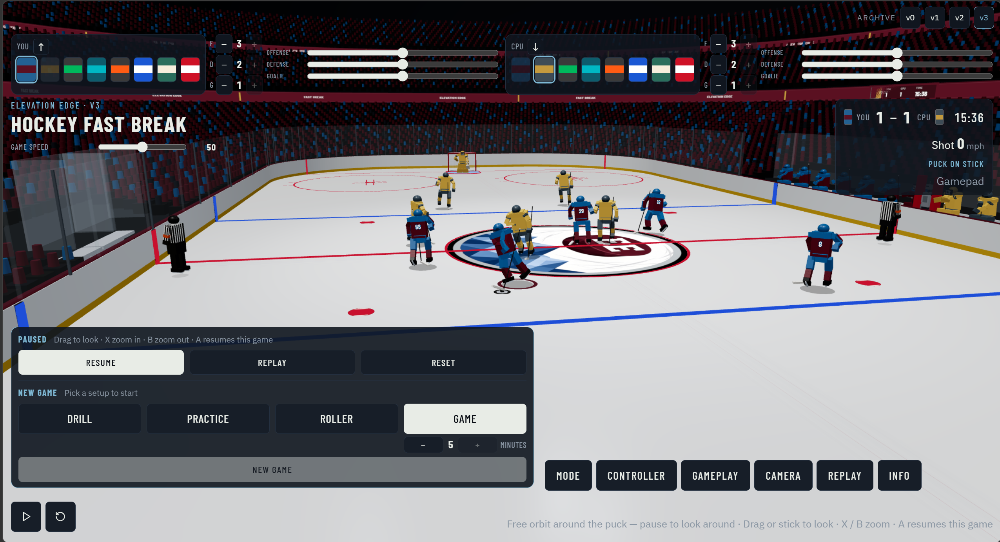

# Hockey Fast Break

Free online hockey game (3D). Compatible with keyboard and gamepad.

[Play now](https://elevation-edge-sports-data.github.io/hockey-fast-break/)

## Modes

- **Drill**: 4, 8, 12, or 16 targets. One minute.
- **Practice**: skater vs goalie
- **Roller**: 4-on-4, no offsides, roller skates
- **Game**: 5-on-5, offsides on, timed (1–10 minutes, opens at 5). The clock still counts down from 20:00.

## Controls

### With the puck

| | Gamepad | Keyboard |
|---|---|---|
| Skate / aim pass or shot | Left stick | WASD or arrows |
| Pass (hold for saucer) | A | E or J |
| Wrist (hold for slap) | X | F, C, or K |
| Cancel slap | B | Space |
| Deke | Y | Q or I |

### Without the puck

| | Gamepad | Keyboard |
|---|---|---|
| Skate | Left stick | WASD or arrows |
| Change player | A | E or J |
| Poke / one-timer on a pass you just sent | X | F, C, or K |
| Hit. Frozen puck: check | Y | Q or I |
| Burst | B | Space |

### Classic profile

| | Gamepad | Keyboard |
|---|---|---|
| Defensive skate | Hold LB | Hold comma or N |
| Take your goalie | Hold Select | Hold R |
| Dive | RT | Shift |

### Wings profile

| | Gamepad | Keyboard |
|---|---|---|
| Steer nearest teammate left / right | Hold LT / RT | Hold G / Shift |
| Defensive skate | Hold LB | Hold comma or N |
| Take your goalie | Hold Select | Hold R |
| Dive | RB | M |

Defensive skate faces the puck, skates slower, and improves hits and intercepts. Hold Select or R to take your goalie on either profile.

Pause is P or Esc. Camera is picked in the pause menu (classic, chase, broadcast, high, freestyle). Freestyle angle and zoom stay on when you resume.

Replay (from pause, last 30 seconds): A play/pause, X / B zoom, stick pan, hold Y and stick to orbit, LT / RT or G / Shift scrub fast, LB / RB or N / M scrub slow, Select or R to exit.

## What you can change

Pick home and away uniforms from eight kits. Home starts in burgundy and blue.

Light or dark rink. Check goalies, check refs. Line brawl: hit a player without the puck into the benches and a line brawl starts. Offsides. Power play (players come back from the box). Chaos (higher on-ice cap, more bodies after a goal). Game speed. Lineup counts and six sliders for user / CPU offense, defense, and goalie.

The home crowd and the ribbons use the home kit. The away crowd sits in an upper-deck corner in the away kit. Home crowd reacts to home goals and finished drill boards. Away crowd reacts to away goals. Three-deck bowl, press box, jumbotron with a live video board, Elevation Edge logo at center ice.

HUD: YOU–CPU (or drill score), clock in Drill and Game, shot speed, puck status.

Archive links to playable v0, v1, v2, and this build.

Not affiliated with, endorsed by, or licensed by any league or team.
